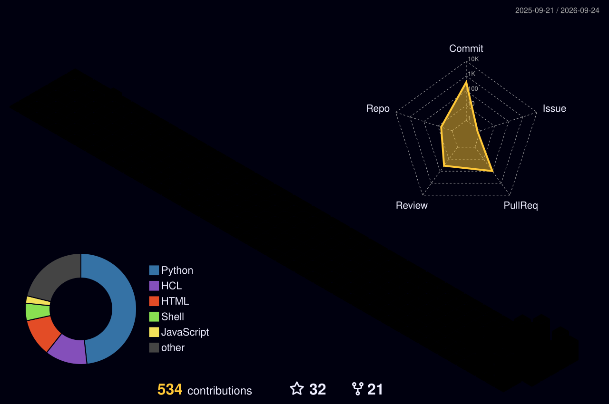

 

---

## 🧬 SYSTEM PROFILE

<table>
<tr>
<td width="50%" valign="top">

### IDENTITY

<strong>Sandeep Komal Pothu</strong>

Cloud & DevOps Engineer focused on reliable infrastructure, automation, security, and observability.

<code>AWS</code> <code>Kubernetes</code> <code>Terraform</code> 
<code>CI/CD</code> <code>Docker</code> <code>DevSecOps</code> 
<code>Observability</code> <code>Automation</code>

</td>
<td width="50%" valign="top">

### MISSION

> Build infrastructure that can <strong>ship itself, defend itself, and tell you when it is unhealthy.</strong>

<code>BUILD</code> → <code>SECURE</code> → <code>DEPLOY</code> → <code>OBSERVE</code> → <code>IMPROVE</code>

</td>
</tr>
</table>

---

## ⚡ LIVE ENGINEERING FABRIC

---

## 🚀 FLAGSHIP SYSTEM — KOMORAPY_V4

A practical application platform connecting <strong>source control → CI/CD → security → container registry → Kubernetes → observability</strong>.

<strong>Explore:</strong> <a href="https://github.com/SandeepKomal/KOMORAPY_V4">KOMORAPY_V4</a>

---

## 🛡️ DEVSECOPS SECURITY FABRIC

<strong>Security layers:</strong> <code>SAST</code> · <code>SCA</code> · <code>Container Security</code> · <code>IaC</code> · <code>Kubernetes</code> · <code>Runtime</code>

---

## ☁️ CLOUD / PLATFORM STACK

<table>
<tr>
<td align="center">☁️ <b>Cloud</b> AWS</td>
<td align="center">☸️ <b>Platform</b> Kubernetes / EKS</td>
<td align="center">🏗️ <b>IaC</b> Terraform</td>
<td align="center">🚀 <b>Delivery</b> GitHub Actions / Jenkins</td>
</tr>
<tr>
<td align="center">🔐 <b>Security</b> DevSecOps</td>
<td align="center">🐳 <b>Containers</b> Docker</td>
<td align="center">📊 <b>Observability</b> Prometheus / Grafana</td>
<td align="center">🤖 <b>Automation</b> Ansible / Python / Shell</td>
</tr>
</table>

---

## 📡 ENGINEERING TELEMETRY

 

---

## 🐍 CONTRIBUTION MATRIX

---

## 🧊 3D CONTRIBUTION UNIVERSE

> Generated automatically by the pinned GitHub Actions workflow.

---

## ⚡ ACTIVITY STREAM

<!--START_SECTION:activity-->
1. 🎉 Merged PR [#132](https://github.com/SandeepKomal/KOMORAPY_V4/pull/132) in [SandeepKomal/KOMORAPY_V4](https://github.com/SandeepKomal/KOMORAPY_V4)
2. 💪 Opened PR [#132](https://github.com/SandeepKomal/KOMORAPY_V4/pull/132) in [SandeepKomal/KOMORAPY_V4](https://github.com/SandeepKomal/KOMORAPY_V4)
3. ℹ️ Assigned PR [#42](https://github.com/SandeepKomal/KOMORAPY_V4/pull/42) in [SandeepKomal/KOMORAPY_V4](https://github.com/SandeepKomal/KOMORAPY_V4)
4. ❌ Closed PR [#42](https://github.com/SandeepKomal/KOMORAPY_V4/pull/42) in [SandeepKomal/KOMORAPY_V4](https://github.com/SandeepKomal/KOMORAPY_V4)
5. ℹ️ Assigned PR [#8](https://github.com/SandeepKomal/SandeepKomal/pull/8) in [SandeepKomal/SandeepKomal](https://github.com/SandeepKomal/SandeepKomal)
<!--END_SECTION:activity-->

---

## 🏆 ACHIEVEMENTS

---

## ✍️ ENGINEERING NOTES

<code>AWS</code> · <code>Kubernetes</code> · <code>Terraform</code> · <code>CI/CD</code> · <code>DevSecOps</code> · <code>Cloud Security</code> · <code>Observability</code>

> <strong>Learn by building. Build by automating. Improve by observing.</strong>

---

## 🌐 CONNECT

<strong>AUTOMATE • SECURE • OBSERVE • SCALE</strong>

